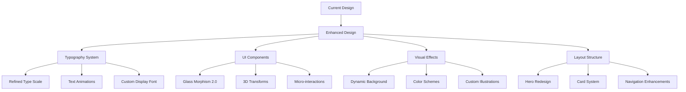

# The Spandex Conspiracy - Website Beautification Plan

## Current Design Observations

- Using Tailwind CSS with custom utility classes
- Animated gradient background with floating shapes
- Custom "spandex" color palette
- Simple navigation and layout structure
- Some animations and transitions already implemented
- Inter and Poppins fonts for content and headings

## Proposed Enhancements

### 1. Visual Hierarchy and Typography Improvements

- **Enhanced Typography System**
  - Implement a more refined typographic scale with better visual hierarchy
  - Add custom letter-spacing for headings and improved line heights
  - Introduce text gradient effects for key headings and titles
  - Add animated text reveals for important content sections

- **Custom Font Pairing**
  - Consider adding a more distinctive display font for main headings to complement Inter/Poppins
  - Implement proper font fallbacks and optimize font loading

### 2. Modern UI Components & Visual Elements

- **Glass Morphism Enhancement**
  - Create more sophisticated glass-effect components with better depth
  - Add subtle inner shadows and highlights to glass surfaces
  - Implement variable backdrop blur effects based on scroll position

- **3D Elements & Depth**
  - Add subtle 3D transforms to cards and UI elements on hover
  - Implement parallax scrolling effects for background elements
  - Create depth with layered design and strategic shadows

- **Micro-interactions**
  - Add subtle hover animations to all interactive elements
  - Implement scroll-triggered animations for content sections
  - Create custom loading states and transitions between pages

### 3. Advanced Visual Effects

- **Enhanced Background & Environment**
  - Upgrade the current gradient animation with more sophisticated patterns
  - Add subtle animated noise texture overlay for depth
  - Create a dynamic SVG wave or blob animation in the background
  - Implement subtle particle effects that respond to user interactions

- **Dynamic Color Schemes**
  - Expand the color palette with complementary accent colors
  - Add color mode toggle (light/dark) with smooth transitions
  - Implement subtle color shifts based on scroll position or time of day

- **Custom Illustrations & Graphics**
  - Create custom SVG illustrations related to the story themes
  - Add decorative elements that tie into the spandex conspiracy narrative
  - Implement animated character elements related to the story

### 4. Layout & Structural Improvements

- **Hero Section Redesign**
  - Create a more impactful hero section with asymmetrical layout
  - Add animated elements that reveal on page load
  - Implement a more distinctive visual for the hero area

- **Content Card Redesign**
  - Update card designs with more distinctive shapes and borders
  - Add visual storytelling elements to content cards
  - Implement better spacing and rhythm throughout content sections

- **Navigation Enhancement**
  - Redesign navigation with more distinctive styling
  - Add subtle animation for the active state indicator
  - Create a more engaging mobile navigation experience

### 5. Performance & Technical Improvements

- **Animation Optimization**
  - Ensure all animations are using GPU acceleration
  - Implement will-change for smoother animations
  - Add animation preferences respect (reduced motion)

- **Responsive Design Refinement**
  - Enhance mobile experience with touch-friendly interactions
  - Create better adaptive layouts for different screen sizes
  - Implement container queries for more flexible components

## Visual Design Direction

## Implementation Approach

We recommend a phased implementation approach:

1. **Foundation Phase**: Enhance typography system and color palette
2. **Component Phase**: Upgrade UI components with new styling and interactions
3. **Effects Phase**: Implement advanced visual effects and animations
4. **Polish Phase**: Fine-tune responsive behavior and optimize performance

## Specific Implementation Tasks

### Phase 1: Foundation
- [ ] Add new display font for headings
- [ ] Refine typography scale and spacing
- [ ] Expand color palette with additional accents
- [ ] Implement text gradient effects for headings

### Phase 2: Components
- [ ] Enhance glass effect components with improved depth
- [ ] Add hover effects and micro-interactions to all buttons
- [ ] Upgrade card designs with more distinctive styling
- [ ] Improve navigation with animated indicators

### Phase 3: Visual Effects
- [ ] Create dynamic background animations
- [ ] Add particle or blob effects to hero section
- [ ] Implement scroll-triggered animations
- [ ] Add custom SVG illustrations for key sections

### Phase 4: Polish
- [ ] Optimize all animations for performance
- [ ] Ensure responsive design across all breakpoints
- [ ] Add reduced motion alternatives
- [ ] Final testing and refinement
